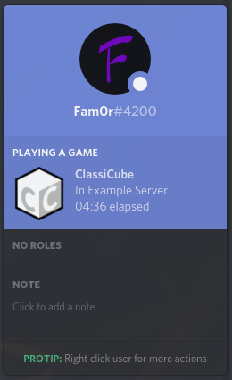

# ClassiCube-RPC

A discord rich presence plugin for ClassiCube.

## Download:

* [Windows 64-Bit](https://github.com/Fam0r/ClassiCube-RPC/releases/latest/download/Win64.zip)
* [Windows 32-Bit](https://github.com/Fam0r/ClassiCube-RPC/releases/latest/download/Win32.zip)
* [Linux 64-Bit](https://github.com/Fam0r/ClassiCube-RPC/releases/latest/download/Nix64.zip)

Unzip the archive into your ClassiCube directory. Make sure the Discord.dll/so file is in the plugins folder and discord_game_sdk.dll/so is in the same folder as your game executable.